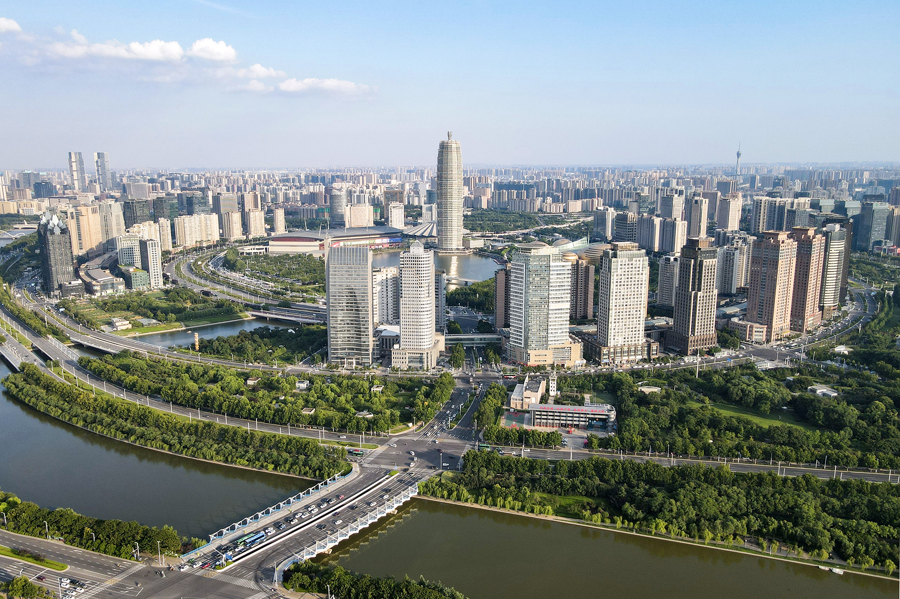
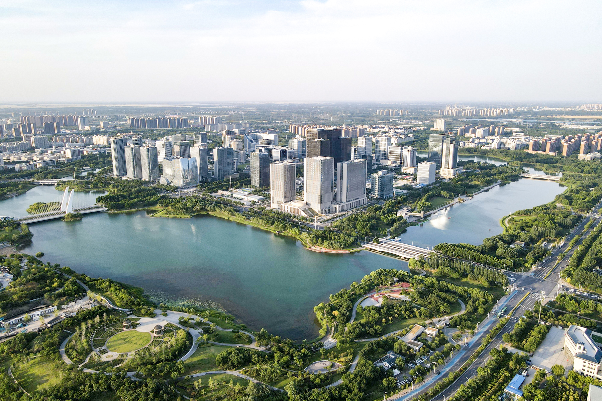
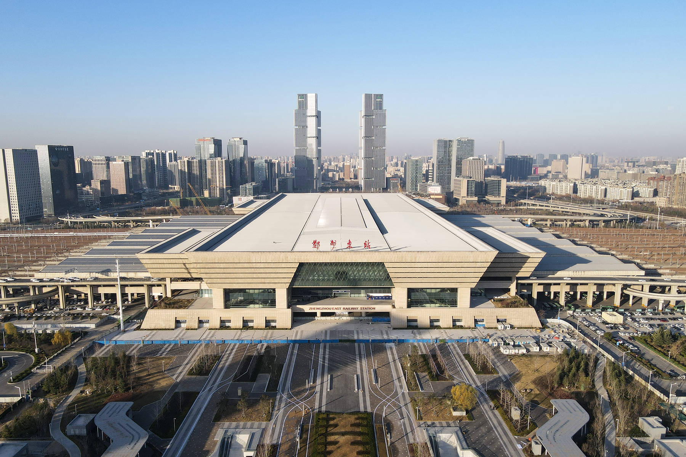

## Overview

Zhengzhou, the capital of Henan Province, is rapidly transforming into a major smart city hub in central China. At the heart of this transformation is the Zhengdong New District (ZND), a large-scale urban development project that integrates digital governance, artificial intelligence, and big data analytics to improve municipal management and public services. The district has been positioned as a model for leveraging advanced technologies to enhance urban efficiency, sustainability, and quality of life. As part of Zhengzhou’s broader digitalization strategy, ZND is pioneering the use of intelligent transportation systems, automated administrative services, and smart infrastructure to create a highly connected and responsive urban environment. This case study examines the core components of the district’s smart city initiatives, analyzing its development goals, technological interventions, key stakeholders, funding mechanisms, and anticipated outcomes. The findings are supported by extensive research into government policies, project reports, and expert analysis. A comprehensive list of references is provided at the end of this document.

Central Business District of Zhengdong New Area

## Key Characteristics

Zhengdong New District has established a comprehensive framework to drive digital transformation, focusing on the integration of urban data, AI-driven decision-making, and cloud-based infrastructure. A central component of this initiative is the Zhengzhou Smart Governance Platform, which consolidates real-time data from multiple city departments to improve coordination across municipal functions. In addition, the district has made significant investments in 5G technology, IoT sensors, and automated monitoring systems, which facilitate intelligent resource management and predictive analytics. These efforts align with national and provincial digital economy strategies, reinforcing Zhengzhou’s position as a leading smart city in central China. According to the Zhengzhou Big Data Administration Bureau, the district’s data-sharing framework has already streamlined over 120 government processes, reduced administrative delays and enhancing public service efficiency (Zhengzhou Big Data Administration Bureau, 2024, China Daily, 2024).

A key objective of Zhengdong New District’s smart city strategy is fostering active citizen participation in governance and service optimization. The district has deployed multiple digital engagement platforms that allow residents to access real-time urban data, provide feedback on government services, and participate in policy discussions. The introduction of the “One-Stop Digital Government” initiative has enabled over 85 percent of administrative procedures to be completed online, significantly improving service accessibility for citizens and businesses (Zhengzhou Municipal Government, 2023, South China Morning Post, 2024). Additionally, smart community networks have been established to enhance neighborhood-level governance by integrating AI-driven monitoring systems, digital identity verification, and emergency response coordination. These initiatives demonstrate a strong commitment to increasing transparency and responsiveness in urban management (Tencent News, 2024).

The deployment of smart city technologies in Zhengdong New District is being carried out in multiple phases, each focusing on enhancing specific urban functions. One of the most ambitious components of this initiative is the AI-powered traffic management system, which uses real-time data analytics to optimize road usage and minimize congestion. This system has already contributed to a 27 percent reduction in average travel times across the district (Tencent News, 2024, Zhengzhou Traffic Bureau, 2024). Moreover, the implementation of blockchain-enabled digital governance solutions has improved data security and reduced bureaucratic inefficiencies. By integrating AI-based decision-support tools, municipal authorities can monitor infrastructure performance, predict maintenance needs, and allocate resources more effectively. These advancements are transforming Zhengdong New District into a highly automated and resilient urban environment (People’s Daily, 2024).

View of Longzihu

## Goals and Aspirations

**Enhance digital infrastructure.** Develop an integrated smart city platform that consolidates municipal data from multiple sources to improve decision-making and service delivery (Zhengzhou Smart City Master Plan, 2023, China Daily, 2024)

**Optimize urban mobility.** Leverage AI-powered traffic control systems to dynamically adjust road signals, minimize bottlenecks, and improve public transportation efficiency (China Daily, 2024, Tencent News, 2024)

**Expand e-governance capabilities.** Implement AI-driven automation tools to streamline administrative processes and reduce paperwork, cutting service wait times by up to 70 percent (People’s Daily, 2023, Zhengzhou Municipal Government, 2024)

**Strengthen data security and privacy.** Establish a blockchain-based data governance framework to ensure compliance with national cybersecurity regulations and protect sensitive information (South China Morning Post, 2024, Zhengzhou Big Data Administration Bureau, 2024)

**Advance green urban development.** Deploy smart energy grids, AI-based pollution monitoring, and digital waste management systems to improve environmental sustainability (Tencent News, 2024, Zhengzhou Environmental Bureau, 2024)

## Technology Interventions

ZND has implemented an AI-based traffic system that analyzes real-time road data to adjust traffic light timing, reducing congestion by up to 30%. Integration with public transport schedules further improves flow.

The “Zhengzhou Digital Citizen” platform supports digital access to services including tax filing, social security, and housing registration. Over 85% of common administrative services are now digitized. Smart kiosks extend access to citizens without smartphones.

Blockchain technology underpins data transactions between departments, increasing traceability and transparency while reducing data leakage risk. Predictive maintenance tools monitor city infrastructure and reduce downtime.

Zhengzhoudong Railway Station

## Stakeholders

The successful development of Zhengdong New District's smart city initiative hinges on the collaboration of various stakeholders:

Local Government Authorities: The Zhengzhou Municipal Government and the Zhengdong New District Management Committee play pivotal roles in policy formulation, strategic planning, and providing essential funding and resources for the smart city projects. Their leadership ensures alignment with national development goals and addresses local needs.

Technology Providers: Companies such as Inspur have been instrumental in implementing technological solutions. For instance, Inspur's involvement in the Zhengdong New District's City Brain project has enhanced urban management through integrated platforms that facilitate intelligent decision-making and efficient public services. inspur.com

Financial Institutions: Banks like China Zheshang Bank and China Minsheng Bank offer financial products and services tailored to support the digital economy and smart city infrastructure projects. Their involvement provides the necessary financial backing for large-scale urban development initiatives. 棉花银行

Academic and Research Institutions: Universities and research centers contribute by conducting studies on urbanization challenges and technological innovations, offering insights that guide the development and implementation of smart city solutions.

## Leadership

Effective leadership is crucial for the advancement of Zhengdong New District's smart city projects:

Government Leadership: Local government leaders are responsible for setting strategic directions, ensuring the integration of smart technologies into urban planning, and fostering collaborations among various stakeholders. Their vision and commitment drive the momentum of smart city initiatives.

Corporate Leadership: Executives from technology firms and financial institutions bring expertise in innovation and project management. Their leadership ensures that technological implementations are both cutting-edge and practical, aligning with the city's goals.

## Financing

The financial framework supporting Zhengdong New District's smart city initiatives involves multiple strategies:

Government Funding: Allocations from municipal budgets are directed toward foundational infrastructure and pilot projects, demonstrating the government's commitment to smart city development.

Private Investments: Public-private partnerships attract investments from technology companies and financial institutions, sharing risks and benefits while accelerating project implementation.

Special Funds: Establishment of dedicated funds supports digital technology innovation and data governance projects, encouraging enterprises to participate in the smart city ecosystem.

## Outcomes

Enhanced Urban Management: The implementation of the City Brain project has led to more efficient urban management, integrating various data sources to improve decision-making processes. 

Improved Public Services: Smart applications have been developed to provide residents with convenient access to services, enhancing the overall quality of life in the district.

Economic Growth: The focus on digital infrastructure has attracted businesses and stimulated economic activities, positioning Zhengdong New District as a hub for innovation and technology.

## Open Questions

**How will the district address long-term data privacy concerns?**

**What steps are being taken to ensure digital inclusion across all socioeconomic groups?**

**Can the technology model developed in ZND be adapted to smaller or less wealthy municipalities?**

## References

### Primary Sources
- Zhengzhou Big Data Administration Bureau Reports (2024): https://www.zhengzhou.gov.cn/news4/7920881.jhtml
- https://www.zhengzhou.gov.cn/news4/9100527.jhtml
- https://www.hnswjrb.gov.cn/2025/02-05/3307583.html

### Secondary Sources
- https://cn.chinadaily.com.cn/a/202303/03/WS6401a7eaa3102ada8b231b30.html
- https://henan.sina.com.cn/news/2024-01-29/detail-inafcxst8258993.shtml
- https://lw.xinhuanet.com/2021-04/27/c_139904595.htm
- https://www.smartcity.team/policies/smartcitypolicies/zhengzhouzhihuichengshi/
- https://www.inspur.com/lcjtww/2315750/2320981/2345517/2345521/2345733/index.html
- https://www.pishu.com.cn/skwx_ps/multimedia/ImageDetail?ContentType=MultimediaImageContentType&ID=13158967&SiteID=14
- https://xianxiao.ssap.com.cn/catalog/6165204.html
- https://www.planning.org.cn/news/search?page=3&schkey=城市更新
- https://www.zhengdong.gov.cn/bmdt/5660102.jhtml
